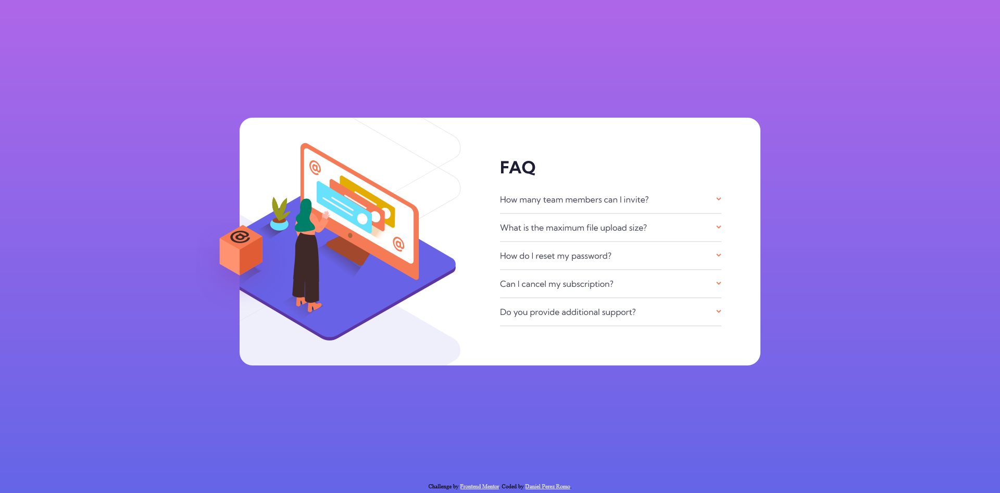

# Frontend Mentor - FAQ accordion card solution

This is a solution to the [FAQ accordion card challenge on Frontend Mentor](https://www.frontendmentor.io/challenges/faq-accordion-card-XlyjD0Oam). Frontend Mentor challenges help you improve your coding skills by building realistic projects. 

## Table of contents

- [Overview](#overview)
  - [The challenge](#the-challenge)
  - [Screenshot](#screenshot)
  - [Links](#links)
- [My process](#my-process)
  - [Built with](#built-with)
  - [What I learned](#what-i-learned)
  - [Continued development](#continued-development)
  - [Useful resources](#useful-resources)
- [Author](#author)

**Note: Delete this note and update the table of contents based on what sections you keep.**

## Overview

### The challenge

Users should be able to:

- View the optimal layout for the component depending on their device's screen size
- See hover states for all interactive elements on the page
- Hide/Show the answer to a question when the question is clicked

### Screenshot



### Links

- Solution URL: [Add solution URL here](https://www.frontendmentor.io/solutions/faq-accordion-card-V4iHZKx_sS)
- Live Site URL: [Add live site URL here](https://daniel77apr.github.io/Frontend-Mentor-Faq-accordion-card-main/)

## My process

### Built with

- Semantic HTML5 markup
- CSS custom properties
- Flexbox
- CSS Grid

### What I learned

Position objects using top/left and transfrom: translate 

To center an element with an absolute position you can use left: 50% and transform: translateX(-50%) to center horizontally or top: 50% and transform: translateY(-50%) to center vertically.

This combination of properties is also useful when trying to place different elements in the same position relative from each other, independently of their position within another element like the body of the page itself. 
In other words, this lets elements move together along the page without any parallax effect, as if they were grouped together.
To achieve this, the elements must have the same top/bottom or left/right value, and then we can adjust the translate value of each element so that they are in the desired position.

Example:

```css
#box-image {
    position: absolute;
    top: 50%;
    transform: translateY(-20%);
}

#woman-online-image {
    position: absolute;
    top: 50%;
    transform: translateY(-50%);
}

#shadow-image {
    position: absolute;
    top: 50%;
    transform: translateY(-50%);
}
```

### Continued development

I need to keep learning how to use CSS grids and how to optimize JavaScript code.


### Useful resources

- (https://medium.com/front-end-weekly/absolute-centering-in-css-ea3a9d0ad72e) - This helped me learn how to center elements with absolute postition.

## Author
Daniel Perez Romo
- GitHub - [Daniel77apr](https://github.com/Daniel77apr)
- Frontend Mentor - [@Daniel77apr](https://www.frontendmentor.io/profile/Daniel77apr)
